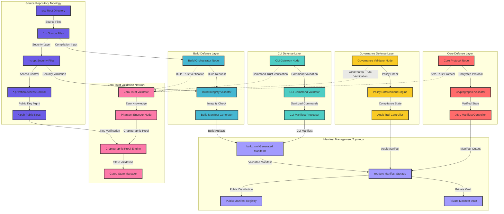

# OBINexus Zero Trust Topology UML Architecture

## Component Node-Network Defense Architecture

## Zero Trust Topology Implementation

### Defense Layer Architecture

The zero trust topology implements multiple defense layers that operate as autonomous protocol nodes within the OBINexus ecosystem. Each layer maintains independent validation capabilities while participating in the distributed verification network.

**Core Defense Layer** operates as the primary security boundary, implementing cryptographic validation and XML manifest control. The Core Protocol Node maintains system state integrity while coordinating with downstream validation systems.

**CLI Defense Layer** provides command-line interface security through sanitized command processing and CLI-specific manifest generation. The CLI Gateway Node ensures that all command-line interactions undergo comprehensive validation before system integration.

**Build Defense Layer** manages compilation integrity through orchestrated build processes and comprehensive artifact validation. The Build Orchestrator Node coordinates with source repository topology to ensure secure compilation workflows.

**Governance Defense Layer** implements policy enforcement and audit trail management through systematic compliance verification. The Governance Validator Node maintains regulatory compliance while enabling flexible operational procedures.

### Node-Network Verification Protocol

The verification protocol implements distributed validation across all topology nodes using the established Sinphasé methodology. Each node operates independently while contributing to system-wide security through coordinated verification procedures.

**Zero Trust Validation Network** provides cryptographic proof generation through the Phantom Encoder pattern and comprehensive state management. The Zero Trust Validator coordinates with all defense layers to ensure systematic security enforcement.

**Cryptographic Proof Engine** implements mathematical verification based on the odd perfect number cryptographic integrity framework. The proof engine generates verifiable certificates for each operational transition while maintaining zero-knowledge security properties.

**Gated State Manager** enforces state transition protocols that require explicit validation before system progression. The state manager implements checkpoint-based validation that ensures comprehensive quality assurance before deployment authorization.

### XML Manifest Flow Architecture

The manifest flow architecture implements systematic handling of XML manifests across source repositories and build artifacts. When public/private .xml files are deleted from src/ and missy/ directories, the system automatically relocates build/.xml manifests to root/src for continued operation.

**Manifest Management Topology** provides centralized coordination of manifest storage and distribution. The system maintains build/.xml artifacts in root/src directories while enabling continued CLI build operations through relocated manifest processing.

**Source Repository Integration** ensures that source files maintain security through layered cryptographic validation. The .in source files undergo validation through .crypt security files, .privation access control, and .pub public key management before build integration.

### CLI Integration with Governance

The CLI integration implements pre-governance validation that ensures sample CLI builds operate correctly before formal governance approval. The system supports github.com/gov-repo integration through standardized manifest validation procedures.

**Command Trust Verification** provides systematic validation of CLI commands through zero trust protocols before system integration. Each CLI operation undergoes cryptographic verification and policy compliance assessment before execution authorization.

**Build Integrity Validation** ensures that relocated manifest operations maintain system integrity while enabling flexible development workflows. The system validates build artifacts against source repositories through comprehensive cryptographic verification procedures.

### Implementation Requirements

The zero trust topology requires systematic implementation of defense layers with comprehensive verification procedures. Each node must implement both CLI and library interfaces while maintaining cost monitoring and phase-aware activation logic as specified in the Sinphasé framework.

The system implements automatic manifest relocation procedures that maintain build functionality when source .xml files are removed. CLI build operations continue through relocated manifest processing while maintaining comprehensive security validation throughout the compilation workflow.

